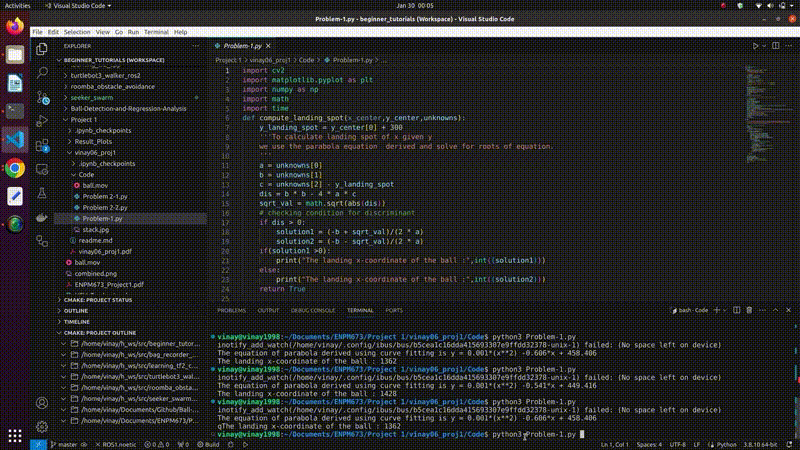
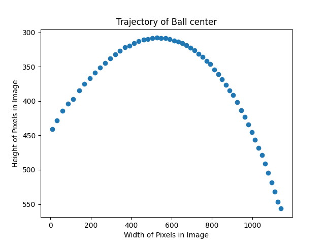
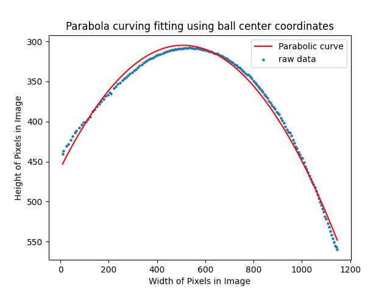
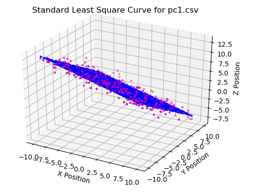
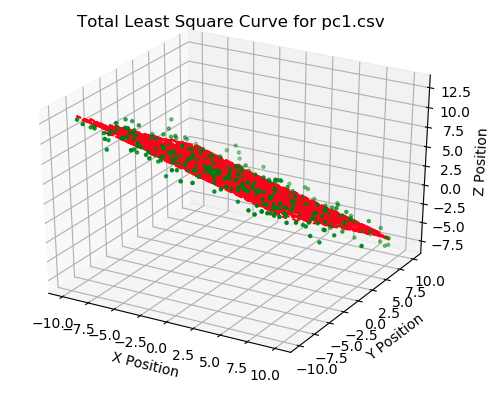
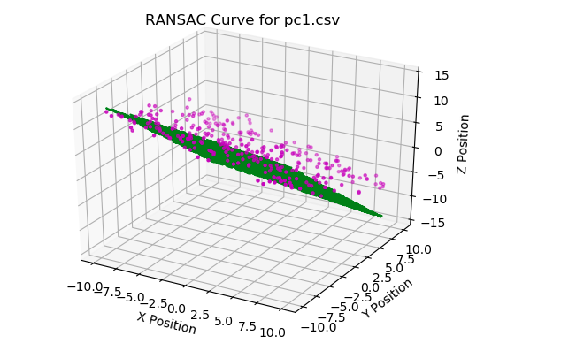

## Introduction : 
A Trajectory of the ball is detected from a video by Image processing of each frame in the video using OpenCV. The Second Task is performing regression analysis on Point Cloud 3D Data using regression methods such as Least Squares, Total Least Squares, RANSAC.

### Overview and Results of Ball Trajectory Detection:

A video sequence is processed to track the trajectory of a red ball. Each frame in the video is HSV masked to detect the red colored ball. Once, the ball is detected the mean center of the ball is calculated and higlighted back in the frame. This is can be observed through the video below

The ball center in each frame of the video is tracked and a parabolic curve is drawn considering all the centers showing the accurate trajectory followed by the ball in the whole sequence.

  
  

To execute the code related follow the instructions below: 

1. Please download the source code for Problem-1.py and open it any Python IDE.
2. Before running the file please make sure the "ball.mov" file from data folder is in the same folder as this script.
3. Install necessary libraries such as opencv, numpy, matplotlib if unavailable on the system and run the program

### Overview and Results of Ball Trajectory Detection:

Using the noisy point cloud data present in the csv files, three different estimation algorithms like Standard Least Squares, Total Least Squares and RANSAC are used to fit a surface. The results of which are as below

  
  
  

To execute the code related follow the instructions below: 
1. Download the source code Problem 2-1.py and Problem 2-2.py and open using Python IDE.
2. Before running the file please make sure the "pc1.csv" and "pc2.csv" files are in the same folder as this script.
3. Install necessary libraries such as opencv, numpy, matplotlib if unavailable on the system and execute the code

